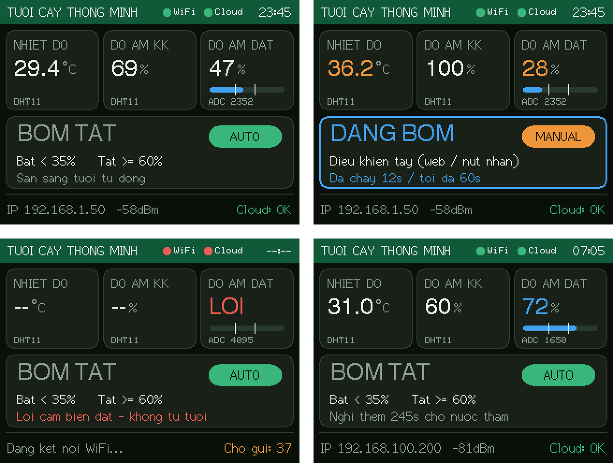

# HỆ THỐNG TƯỚI CÂY THÔNG MINH IoT (ESP32 + Cloud)

ESP32 đọc **DHT11** (nhiệt độ, độ ẩm không khí) và **cảm biến độ ẩm đất**, hiển thị trên **màn hình TFT ILI9341 320x240**, giữ giờ bằng **đồng hồ DS1302**, điều khiển **máy bơm qua relay 5V** với 2 chế độ **AUTO / MANUAL**. Dữ liệu và lệnh điều khiển đi qua **server cloud chạy 24/7** có **IP/tên miền công cộng** — ai có tài khoản đều vào được từ bất kỳ mạng nào (4G, WiFi khác…). Có **quản lý người dùng** (đăng ký, phân quyền, khoá tài khoản) và **quản lý thiết bị** (thêm, đổi tên, cấp khoá, chuyển chủ sở hữu).

```
                         Internet (ai cũng truy cập được)
   Điện thoại / Laptop ──────────────┐
   https://ten-app.onrender.com      │ HTTPS
                                     ▼
                     ┌─────────────────────────────┐
                     │  Render (Node.js + Express) │  ← Web dashboard + REST API
                     │  - Đăng nhập (JWT, bcrypt)  │
                     │  - Quản lý user / thiết bị  │
                     │  - API đồng bộ cho ESP32    │
                     └──────────────┬──────────────┘
                                    │ khoá service_role (chỉ server giữ)
                                    ▼
                     ┌─────────────────────────────┐
                     │  Supabase (PostgreSQL)      │  ← users, devices, lịch sử, nhật ký bơm
                     └─────────────────────────────┘
                                    ▲
                                    │ HTTPS POST /api/device/sync mỗi 5 giây
                     ┌──────────────┴──────────────┐
                     │ ESP32                        │
                     │ Core 1: cảm biến + bơm + TFT │ ← vẫn tự tưới khi mất Internet
                     │         + web nội bộ         │
                     │ Core 0: đồng bộ cloud        │
                     └──────────────────────────────┘
            DHT11   Cảm biến đất   Relay → Bơm   TFT ILI9341   DS1302
```

## Cấu trúc thư mục

```
smart-irrigation/
├── database/schema.sql              ← chạy 1 lần trong Supabase SQL Editor
├── backend/                         ← đẩy lên GitHub, Render tự build
│   ├── server.js
│   ├── package.json
│   ├── .env.example
│   ├── src/  (config, db, auth, validate, routes/*)
│   └── public/  (web dashboard: index.html, app.css, app.js)
├── firmware/                        ← project PlatformIO (mở bằng VS Code)
│   ├── platformio.ini               ← thư viện cần tải + CHÂN MÀN HÌNH TFT
│   ├── include/app_config.h         ← SỬA FILE NÀY (WiFi, URL server, khoá, chân cảm biến)
│   ├── include/app_types.h          ← các struct dùng chung (C thuần)
│   ├── src/main.cpp                 ← chỉ nối các thư viện lại với nhau
│   ├── lib/…                        ← mỗi chức năng 1 thư viện riêng (xem mục 6.3)
│   └── test/test_logic/             ← unit test cho phần C thuần
├── docs/tft_preview.png             ← ảnh giao diện màn hình TFT
├── render.yaml                      ← tạo service Render tự động (tuỳ chọn)
└── README.md
```

---

## 1. Linh kiện và sơ đồ nối dây

| Linh kiện | Chân linh kiện | Nối vào ESP32 | Ghi chú |
|---|---|---|---|
| **TFT ILI9341 2.4"/2.8" (SPI)** | VCC | 3V3 | Module có IC ổn áp (jumper J1 hở) thì cấp 5V cũng được |
| | GND | GND | |
| | CS | **GPIO 15** | |
| | RESET | **GPIO 4** | |
| | DC (hoặc RS/A0) | **GPIO 2** | LED xanh trên board ESP32 sẽ nháy theo, bình thường |
| | SDI (MOSI) | **GPIO 23** | |
| | SCK | **GPIO 18** | |
| | LED (đèn nền) | 3V3 | |
| | SDO (MISO) | GPIO 19 | Không bắt buộc |
| DHT11 (module 3 chân) | VCC | 3V3 | |
| | DATA | **GPIO 16** | Module đã có trở kéo lên. Nếu là cảm biến 4 chân trần: thêm trở 10 kΩ từ DATA lên 3V3 |
| | GND | GND | |
| Cảm biến độ ẩm đất | VCC | **3V3** | ⚠ Không cấp 5V: chân AO có thể lên 5V, làm hỏng ESP32 |
| | AO | **GPIO 34** | Phải là chân ADC1 (32–39). Chân ADC2 không đọc được khi bật WiFi |
| | GND | GND | |
| Module relay 5V (1 kênh) | VCC | **VIN (5V)** | Lấy 5V từ cổng USB |
| | IN | **GPIO 26** | Relay kích mức thấp → `RELAY_ACTIVE_LOW 1` |
| | GND | GND | |
| Nút nhấn (tuỳ chọn) | 1 chân | **GPIO 27** | Chân còn lại nối GND (dùng trở kéo lên nội) |
| **Đồng hồ DS1302** | VCC | **3V3** | ⚠ Không cấp 5V: chân DAT sẽ ra mức 5V vào ESP32 |
| | GND | GND | |
| | CLK | **GPIO 25** | |
| | DAT | **GPIO 33** | |
| | RST | **GPIO 32** | Có module ghi là CE |

> Màn hình đã nối theo chân khác? Sửa các dòng `-DTFT_...` trong `platformio.ini`. Chân cảm biến / relay / nút sửa trong `include/app_config.h`. Nhớ **không để trùng** chân giữa 2 file. Các chân TFT như trên dùng bus VSPI phần cứng nên màn hình chạy nhanh nhất.

**Mạch bơm** (tách riêng khỏi ESP32):

```
 Nguồn bơm (+5V hoặc 12V) ──── COM [RELAY] NO ──── (+) Máy bơm (−) ──── GND nguồn bơm
                                                     └──|◄──┘  Diode 1N4007 song song với bơm
                                                        (vạch trắng của diode về phía +)
```

- Dùng **nguồn riêng cho bơm** (adapter 5V/1A hoặc 12V tuỳ bơm), không lấy từ chân 3V3 của ESP32.
- Diode chống ngược giúp dập xung khi bơm tắt — thiếu nó ESP32 dễ bị **reset ngẫu nhiên**.
- Nếu relay không đóng khi IN = 3.3V: dùng module relay có opto, hoặc thêm transistor NPN (2N2222) đệm.

---

## 2. Tạo database trên Supabase

1. Vào <https://supabase.com> → **New project**. Region: **Southeast Asia (Singapore)**.
   > Nên tạo **project mới** cho đồ án này (gói Free cho 2 project). Tên bảng đã được đặt khác project cũ (`sensor_readings` thay vì `sensor_logs`) nên dùng chung cũng không xung đột.
2. Menu trái → **SQL Editor** → **New query** → dán toàn bộ nội dung `database/schema.sql` → **Run**. Thấy *Success* là xong.
3. **Project Settings → API Keys** (hoặc **API**), ghi lại:
   - **Project URL**: `https://xxxx.supabase.co`
   - Khoá **secret** (`sb_secret_...`) hoặc khoá **service_role** (tab *Legacy API keys*).
   > Khoá này có toàn quyền DB. Chỉ nhập vào Render, **không** đưa lên GitHub, không dán vào web hay firmware. Schema đã bật RLS nên khoá *anon/publishable* không đọc được gì.

---

## 3. Đưa server lên Render (có địa chỉ công cộng)

1. Tạo repo GitHub (VD `tuoi-cay-thong-minh`) và đẩy **toàn bộ thư mục `smart-irrigation`** lên. File `.gitignore` đã loại `node_modules` và `.env`.
2. Vào <https://render.com> → đăng nhập bằng GitHub.
3. **Cách nhanh (Blueprint):** New → **Blueprint** → chọn repo → Render đọc `render.yaml` và hỏi 2 biến `SUPABASE_URL`, `SUPABASE_SERVICE_ROLE_KEY` → Apply.

   **Cách thủ công:** New → **Web Service** → chọn repo, điền:

   | Mục | Giá trị |
   |---|---|
   | Root Directory | `backend` |
   | Runtime | Node |
   | Region | Singapore |
   | Build Command | `npm install` |
   | Start Command | `node server.js` |
   | Instance Type | Free |
   | Health Check Path | `/healthz` |

   Environment Variables:

   | Biến | Giá trị |
   |---|---|
   | `SUPABASE_URL` | Project URL ở bước 2 |
   | `SUPABASE_SERVICE_ROLE_KEY` | khoá secret / service_role ở bước 2 |
   | `JWT_SECRET` | chuỗi ngẫu nhiên dài (bấm *Generate* trên Render) |
   | `ALLOW_REGISTER` | `true` (cho mọi người tự đăng ký) hoặc `false` (chỉ admin tạo tài khoản) |

4. Đợi build xong, trạng thái **Live**. Mở `https://<ten-app>.onrender.com/healthz` → thấy `{"ok":true,"db":"ok",...}` là server đã nối được database.

Mở `https://<ten-app>.onrender.com` từ bất kỳ máy nào (không cần chung WiFi) → trang đăng nhập.

---

## 4. Giữ server chạy 24/7

Gói Free của Render **ngủ sau 15 phút không có request**, lần gọi đầu sau đó mất khoảng 1 phút để khởi động lại. Supabase Free **tạm dừng project sau 7 ngày không có hoạt động**.

- **Khi ESP32 đang cắm điện:** ESP32 gọi server mỗi 5 giây nên server không bao giờ ngủ và database luôn có hoạt động. Không cần làm gì thêm.
- **Để chắc chắn 24/7 cả khi ESP32 tắt:** dùng dịch vụ ping miễn phí:
  1. Đăng ký <https://uptimerobot.com> → **New monitor** → HTTP(s).
  2. URL: `https://<ten-app>.onrender.com/healthz`, chu kỳ **5 phút**.
  3. Endpoint này có truy vấn nhẹ vào DB, nên giữ thức **cả Render lẫn Supabase**, và UptimeRobot sẽ gửi email khi server sập.
- Render Free cho **750 giờ/tháng mỗi workspace**, một tháng dài nhất 744 giờ, nên đủ cho **đúng 1 service** chạy liên tục. Đừng giữ thức thêm service Free thứ hai trong cùng workspace, nếu không sẽ hết giờ trước cuối tháng.
- Muốn chắc chắn hơn nữa (không bao giờ bị khởi động lại): nâng Render lên gói trả phí *Starter*.

---

## 5. Tạo tài khoản và thêm thiết bị

1. Mở web → **Đăng ký**. **Tài khoản đăng ký đầu tiên tự động là Quản trị viên (admin).**
2. Trang **Thiết bị** → **+ Thêm thiết bị** → nhập tên, vị trí → **Tạo thiết bị**.
3. Cửa sổ hiện **khoá thiết bị** (`dev_...`). **Sao chép ngay**, vì khoá chỉ hiện một lần (DB chỉ lưu bản băm SHA-256). Mất khoá thì bấm **Tạo khoá mới** trong trang thiết bị.

---

## 6. Firmware ESP32 (PlatformIO)

### 6.1. Nạp chương trình
1. Cài **VS Code** → tab Extensions → cài **PlatformIO IDE**.
2. **File → Open Folder** → chọn thư mục `firmware/` (thư mục có file `platformio.ini`).
   PlatformIO tự tải nền tảng ESP32 và các thư viện trong `lib_deps` (TFT_eSPI, DHT, ArduinoJson) ở lần build đầu. **Không cần** sửa `User_Setup.h` của TFT_eSPI, vì chân màn hình đã khai báo trong `platformio.ini`.
3. Sửa **`include/app_config.h`**:
   ```c
   #define WIFI_SSID     "Ten_WiFi"
   #define WIFI_PASSWORD "Mat_khau"
   #define SERVER_URL    "https://ten-app.onrender.com"   /* không có "/" cuối */
   #define DEVICE_KEY    "dev_...khoá vừa sao chép..."
   ```
4. Thanh trạng thái dưới cùng: **✓ Build** → **→ Upload** → **🔌 Serial Monitor**. Nếu upload báo lỗi kết nối, giữ nút **BOOT** trên board khi thấy "Connecting....".
5. Màn hình hiện giọt nước và "Dang khoi dong...", rồi vào giao diện chính. Serial hiện các dòng `[DATA] ... cloud=OK`. Trên web, thiết bị chuyển sang **Trực tuyến** trong vài giây.

### 6.2. Giao diện màn hình TFT



Bốn trạng thái: bình thường (AUTO) · đang bơm (MANUAL) · mất WiFi + cảm biến đất lỗi + dữ liệu chờ gửi · đang nghỉ giữa 2 lần tưới.
- **Thanh tiêu đề:** chấm xanh/đỏ cho WiFi và Cloud, giờ Việt Nam lấy từ DS1302 (màu cam = DS1302 đang lỗi).
- **Ô độ ẩm đất:** thanh ngang có 2 vạch trắng là ngưỡng bật/tắt. Số chuyển **cam** khi dưới ngưỡng bật, **xanh** khi đủ ẩm, **đỏ "LOI"** khi cảm biến hở dây. Dòng `ADC` dùng để hiệu chuẩn.
- **Khung máy bơm:** viền xanh khi đang bơm, nhãn AUTO/MANUAL, ngưỡng, thời gian đã chạy / thời gian nghỉ còn lại.
- **Chân trang:** IP trong mạng LAN, cường độ WiFi, số bản ghi đang chờ gửi lên cloud.
- Màn hình chỉ vẽ lại phần thay đổi nên không nhấp nháy. Font có sẵn của TFT_eSPI không có dấu tiếng Việt nên chữ trên màn hình viết không dấu.
- Màu bị đảo hoặc đỏ/xanh đổi chỗ: bật dòng `-DTFT_INVERSION_ON=1` hoặc `-DTFT_RGB_ORDER=TFT_BGR` trong `platformio.ini`. Hình bị lộn ngược: đổi `DISPLAY_ROTATION` từ `1` sang `3` trong `app_config.h`.

### 6.3. Cấu trúc firmware — muốn sửa gì thì mở file nào

Mỗi chức năng là **một thư viện riêng** trong `lib/`, gồm file `.h` (khai báo hàm, có chú thích) và file `.c`/`.cpp` (code). `src/main.cpp` chỉ gọi các hàm này.

| Thư viện | Ngôn ngữ | Làm gì | Sửa khi muốn… |
|---|---|---|---|
| `irrigation_logic` | **C thuần** (`.c`) | Thuật toán AUTO / MANUAL / ngắt an toàn, đổi ADC → %, kiểm tra ngưỡng | thay đổi cách quyết định tưới |
| `data_queue` | **C thuần** (`.c`) | Hàng đợi vòng giữ dữ liệu khi mất mạng | đổi cách lưu tạm dữ liệu |
| `app_state` | C++ | Biến dùng chung + khoá (mutex) giữa 2 nhân, các thao tác tại chỗ | thêm trạng thái mới |
| `storage` | C++ | Lưu cài đặt vào NVS (mất điện không mất) | lưu thêm thông tin |
| `sensors` | C++ | Đọc DHT11 + cảm biến đất (lọc trung bình 16 lần) | đổi / thêm cảm biến |
| `pump` | C++ | Bật tắt relay theo kết quả `irrigation_logic`, ghi sự kiện | thêm quạt, van… |
| `button` | C++ | Nút nhấn: chống dội, nhấn ngắn / giữ 2 giây | thêm nút |
| `display` | C++ | Toàn bộ giao diện TFT (màu, vị trí ở đầu file) | đổi giao diện màn hình |
| `net` | C++ | WiFi tự kết nối lại, mDNS | đổi cách kết nối mạng |
| `cloud` | C++ | Task Core 0 đồng bộ với server Render | đổi giao thức với server |
| `local_web` | C++ | Web nội bộ `http://tuoicay.local` (`web_page.h` là HTML) | sửa trang web trên ESP32 |
| `time_utils` | **C thuần** (`.c`) | Đổi ngày giờ ↔ giờ UNIX, mã BCD, kiểm tra ngày, đọc lệnh `SETTIME` | — |
| `rtc_ds1302` | **C** (`.c`) | Driver đọc/ghi chip DS1302 (giao tiếp 3 dây) | đổi sang chip RTC khác |
| `timekeeper` | **C** (`.c`) | Giờ hệ thống luôn lấy từ DS1302, đặt giờ tay, chỉnh lệch theo server | đổi cách giữ giờ |

**Về việc dùng C:** PlatformIO với framework Arduino biên dịch được cả file `.c` lẫn `.cpp`. Phần logic (`irrigation_logic`, `data_queue`, `time_utils`) viết bằng **C thuần**, không phụ thuộc Arduino. Driver DS1302 và `timekeeper` cũng là file `.c`, chỉ gọi các hàm GPIO dạng C của core ESP32 (`digitalWrite`, `pinMode`…). Các thư viện phần cứng như WiFi, HTTPClient, TFT_eSPI, DHT là C++, nên file nào gọi chúng phải là `.cpp`. Tuy vậy code bên trong vẫn viết **kiểu C**: chỉ dùng hàm và `struct`, không tự định nghĩa class, và các header `.h` đều có `extern "C"` để gọi qua lại giữa C và C++.

### 6.4. Chạy unit test trên máy tính (không cần ESP32)
```bash
cd firmware
pio test -e native
```
16 bài test kiểm tra thuật toán tưới (bật/tắt theo ngưỡng, thời gian nghỉ, ngắt an toàn, lỗi cảm biến, chế độ tay), hàng đợi (tràn, gửi bù) và ngày giờ cho DS1302 (năm nhuận, thứ trong tuần, 2000–2099, đọc lệnh `SETTIME`). Windows cần cài gcc (MSYS2/MinGW) trước.

### 6.5. Đồng hồ DS1302 — nguồn giờ duy nhất
DS1302 là **nguồn giờ duy nhất** của hệ thống, **dù có WiFi hay không**. Firmware không dùng NTP. Màn hình, lịch sử đo và nhật ký bơm đều lấy giờ từ DS1302, nên hoạt động giống hệt nhau khi có mạng và khi mất mạng.

- **Cách chạy:** lúc khởi động và cứ **10 giây** một lần, ESP32 đọc DS1302 rồi đặt làm giờ hệ thống. Mỗi lần đọc thực hiện **2 lần liên tiếp và so khớp**, để loại lần đọc sai do nhiễu hoặc lỏng dây.
- **DS1302 bị lỗi giữa chừng** (tuột dây): giờ **không bị mất**. ESP32 tạm chạy tiếp bằng đồng hồ bên trong, giờ trên màn hình chuyển **màu cam**, Serial báo `[RTC] LOI`. Nối lại dây thì tự đọc DS1302 trở lại.
- **Đặt giờ lần đầu** (DS1302 mới hoặc vừa thay pin), chọn một trong ba cách:
  1. Web nội bộ `http://tuoicay.local` → khung **Đồng hồ DS1302** → **Đặt giờ theo máy này**: lấy giờ của điện thoại/laptop ghi vào DS1302. **Không cần Internet.**
  2. Serial Monitor (chọn *Newline*) gõ: `SETTIME 2026-09-29 01:45:00` (giờ Việt Nam). Gõ `TIME` để xem giờ hiện tại.
  3. Để tự động: khi ESP32 kết nối được server lần đầu, giờ server được ghi vào DS1302.
- **Tự chỉnh khi lệch** (`TIME_AUTO_CORRECT 1`, mặc định): có mạng thì ESP32 so giờ DS1302 với giờ server. Chỉ khi **lệch quá 5 giây** mới ghi lại DS1302, còn lại giờ vẫn **đọc từ DS1302**. Đặt `TIME_AUTO_CORRECT 0` nếu muốn DS1302 hoàn toàn độc lập, chỉ chỉnh bằng tay.
- DS1302 lưu giờ **UTC**; màn hình, web và Serial tự cộng 7 tiếng (đổi múi giờ ở `TIMEZONE_OFFSET_SEC`).
- Module dùng pin **CR2032** (không sạc). Mạch sạc (trickle charger) của DS1302 mặc định tắt và firmware không bật nó.

### 6.6. Hiệu chuẩn cảm biến độ ẩm đất (nên làm)
Mỗi cảm biến cho giá trị khác nhau. Xem số **ADC** trên màn hình TFT (hoặc dòng "ADC thô" trên web):
1. Để cảm biến ngoài không khí (khô), đợi 10 giây, ghi số ADC → `SOIL_RAW_DRY`.
2. Nhúng cảm biến vào cốc nước (không ngập quá vạch giới hạn), ghi số ADC → `SOIL_RAW_WET`.
3. Sửa 2 giá trị trong `include/app_config.h` và nạp lại.

---

## 7. Cách hoạt động

### Chế độ AUTO
- Bơm **bật** khi độ ẩm đất **< ngưỡng bật** (mặc định 35%), **tắt** khi **≥ ngưỡng tắt** (mặc định 60%). Hai ngưỡng tách nhau (*hysteresis*) để bơm không bật tắt liên tục quanh một mốc.
- **Bơm tối đa** mỗi lần (mặc định 60 giây): hết thời gian thì bơm tự ngắt, kể cả khi đất chưa đủ ẩm. Việc này chống ngập, chống cháy bơm khi hết nước hoặc cảm biến rơi khỏi chậu.
- **Nghỉ giữa 2 lần** (mặc định 300 giây): chờ nước thấm xuống rồi mới đo và tưới tiếp.
- Cảm biến đất lỗi (tuột dây: ADC sát 0 hoặc 4095) thì bơm tắt và không tự bật.

### Chế độ MANUAL
- Bật/tắt bơm bằng nút trên web. Bấm nút bơm khi đang AUTO thì hệ thống tự chuyển sang MANUAL.
- Giới hạn **bơm tối đa** vẫn áp dụng: quên tắt thì bơm tự ngắt (nhật ký ghi "Ngắt an toàn").
- Sau khi mất điện, ESP32 khởi động lại với bơm **TẮT**, không tự chạy lại lệnh bơm tay cũ.

### Nút nhấn trên mạch (GPIO 27)
- **Nhấn ngắn**: bật/tắt bơm (tự chuyển MANUAL).
- **Giữ 2 giây**: về chế độ AUTO.

### Web nội bộ trên ESP32 (không cần Internet)
Trong cùng mạng WiFi, mở `http://tuoicay.local` (hoặc địa chỉ IP hiện ở chân màn hình TFT). Tài khoản mặc định `admin` / `12345678`, đổi trong `include/app_config.h`. Trang này xem số liệu, đổi chế độ, bật tắt bơm, sửa ngưỡng được cả khi mất Internet. Thay đổi sẽ tự đồng bộ lên cloud khi có mạng lại.

### Mất Internet / server ngủ thì sao?
- Việc tưới chạy trên **Core 1**, hoàn toàn không phụ thuộc mạng. Cloud chậm hay chết, ESP32 vẫn tưới theo cài đặt đã lưu.
- Cài đặt lưu trong **bộ nhớ NVS** của ESP32, **mất điện vẫn còn**.
- Lịch sử đo được giữ trong RAM (tối đa **4 giờ**) và **tự gửi bù** khi có mạng lại, đúng thời gian đo nhờ DS1302, kể cả khi ESP32 khởi động lại lúc đang mất mạng. Lưu ý: dữ liệu chờ gửi nằm trong RAM nên **mất điện thì mất phần chưa gửi**; cài đặt thì vẫn còn.

### Đồng bộ lệnh 2 chiều
Mỗi lần đổi cấu hình trên web, `config_version` tăng thêm 1. ESP32 thấy phiên bản mới trong lần đồng bộ kế tiếp (≤ 5 giây) thì áp dụng. Đổi tại chỗ (nút nhấn, web nội bộ, ngắt an toàn) thì ESP32 giữ nguyên phiên bản và gửi cấu hình mới lên, server tự cập nhật theo. Nếu **cả hai bên cùng đổi trong lúc mất mạng**, lệnh trên web được ưu tiên. Web hiện "Đang gửi lệnh xuống thiết bị…" cho đến khi ESP32 xác nhận.

---

## 8. Quản lý người dùng và thiết bị

| Chức năng | Người dùng | Admin |
|---|:---:|:---:|
| Đăng ký, đăng nhập, sửa thông tin, đổi mật khẩu | ✔ | ✔ |
| Thêm / đổi tên / xoá thiết bị của mình, cấp lại khoá | ✔ | ✔ |
| Điều khiển, xem biểu đồ, nhật ký bơm, tải CSV | thiết bị của mình | mọi thiết bị |
| Xem thống kê hệ thống | | ✔ |
| Tạo tài khoản, đổi vai trò, khoá / mở khoá, đặt lại mật khẩu, xoá | | ✔ |
| Chuyển thiết bị sang người dùng khác | | ✔ |

- Hệ thống luôn giữ **ít nhất 1 admin đang hoạt động** (không tự hạ quyền, tự khoá hay tự xoá được).
- Khoá tài khoản có hiệu lực **ngay lập tức**, không phải đợi token hết hạn.
- Xoá người dùng **không xoá thiết bị**: thiết bị chuyển sang "chưa có chủ", admin gán lại cho người khác.
- Lịch sử cảm biến cũ hơn `RETENTION_DAYS` (mặc định 90 ngày) tự xoá để không vượt 500 MB của Supabase Free.

---

## 9. Tóm tắt API

Mọi API của người dùng gửi header `Authorization: Bearer <token>`.

| Method | Đường dẫn | Mô tả |
|---|---|---|
| POST | `/api/device/sync` | **ESP32** gửi dữ liệu và nhận cấu hình (header `X-Device-Key`) |
| POST | `/api/auth/register` · `/api/auth/login` | Đăng ký · đăng nhập (trả token) |
| GET/PATCH | `/api/auth/me` | Xem / sửa thông tin cá nhân |
| POST | `/api/auth/change-password` | Đổi mật khẩu |
| GET/POST | `/api/devices` | Danh sách (admin: `?all=1`) / thêm thiết bị |
| GET/PATCH/DELETE | `/api/devices/:id` | Xem / sửa tên, vị trí, chủ sở hữu / xoá |
| PATCH | `/api/devices/:id/settings` | `mode`, `manual_pump`, `soil_low`, `soil_high`, `max_pump_sec`, `cooldown_sec` |
| POST | `/api/devices/:id/regenerate-key` | Cấp khoá mới |
| GET | `/api/devices/:id/history?range=1h\|6h\|24h\|7d\|30d` | Dữ liệu biểu đồ (đã gộp trung bình) |
| GET | `/api/devices/:id/events` | Nhật ký bơm |
| GET | `/api/devices/:id/export.csv?range=7d` | Xuất CSV |
| GET | `/api/admin/stats` · `/api/admin/users` | Thống kê · danh sách người dùng |
| POST/PATCH/DELETE | `/api/admin/users[/:id]` | Tạo / sửa (vai trò, khoá) / xoá người dùng |
| POST | `/api/admin/users/:id/reset-password` | Đặt lại mật khẩu |
| GET | `/healthz` | Kiểm tra sống (UptimeRobot) |

Thử giả lập ESP32 bằng curl:
```bash
curl -X POST https://ten-app.onrender.com/api/device/sync \
  -H "Content-Type: application/json" -H "X-Device-Key: dev_..." \
  -d '{"t":28.5,"h":70,"soil":42,"soil_raw":2100,"pump":false,
       "cfg":{"ver":0,"mode":"auto","manual_pump":false,"soil_low":35,"soil_high":60,"max_pump_sec":60,"cooldown_sec":300},
       "logs":[{"ts":0,"t":28.5,"h":70,"soil":42,"pump":false}]}'
```

---

## 10. Xử lý sự cố

| Hiện tượng | Nguyên nhân thường gặp / cách xử lý |
|---|---|
| Serial báo `[CLOUD] Loi HTTP -1` / `-11` vài lần đầu | Render đang khởi động (≈1 phút). ESP32 tự thử lại, sau đó sẽ OK |
| `[CLOUD] Loi HTTP 401` | Sai `DEVICE_KEY` hoặc khoá đã bị tạo lại → dán khoá mới vào `include/app_config.h` |
| `/healthz` báo `db` lỗi | Sai `SUPABASE_URL` / khoá, hoặc project Supabase bị tạm dừng (vào dashboard Supabase bấm *Restore*) |
| Độ ẩm đất luôn 0% hoặc "LOI" | Cắm AO nhầm chân ADC2, cấp nguồn 5V, hoặc chưa hiệu chuẩn `SOIL_RAW_DRY/WET` |
| Nhiệt độ hiện `--` | DHT11 sai chân / thiếu trở kéo lên / cắm ngược VCC-GND |
| Bơm chạy ngược (lệnh tắt lại bật) | Đổi `RELAY_ACTIVE_LOW` thành `0` |
| Màn hình trắng xoá | Sai chân CS/DC/RST trong `platformio.ini`, hoặc chân LED (đèn nền) chưa nối 3V3 |
| Màn hình màu lạ / ngược | Xem mục 6.2 (`TFT_INVERSION_ON`, `TFT_RGB_ORDER`, `DISPLAY_ROTATION`) |
| Màn hình hiện `--:--` | DS1302 chưa có giờ → đặt giờ theo mục 6.5. Nếu đặt xong vẫn mất: sai chân CLK/DAT/RST hoặc pin CR2032 hết |
| Giờ trên màn hình màu cam | Không đọc được DS1302 (lỏng dây) — hệ thống tạm giữ giờ bằng ESP32, nối lại dây là hết |
| Giờ nhảy lung tung sau khi khởi động | Dây DAT lỏng hoặc DS1302 cấp 5V → nối lại, cấp 3V3 |
| Build báo không tìm thấy `app_config.h` | Mở đúng thư mục `firmware/` (chứa `platformio.ini`) trong VS Code |
| ESP32 tự reset khi bơm bật | Thiếu diode song song bơm, hoặc bơm dùng chung nguồn USB với ESP32 → tách nguồn |
| Bấm bơm trên web nhưng "Đang gửi lệnh…" mãi | Thiết bị ngoại tuyến; lệnh sẽ áp dụng khi ESP32 kết nối lại |
| Không vào được `tuoicay.local` | Một số điện thoại Android không hỗ trợ mDNS → dùng địa chỉ IP |

---

## 11. Chạy thử trên máy tính (không bắt buộc)

```bash
cd backend
cp .env.example .env      # điền SUPABASE_URL, SUPABASE_SERVICE_ROLE_KEY, JWT_SECRET
npm install
npm start                 # mở http://localhost:3000
```

## Ghi chú kỹ thuật

- Thời gian lưu dạng `TIMESTAMPTZ DEFAULT now()` (chuẩn UTC), trình duyệt tự hiển thị theo giờ Việt Nam. Tài liệu cũ dùng `timezone('asia/ho_chi_minh', now())` cho cột `TIMESTAMPTZ`, cách này làm giờ lệch 7 tiếng nên đã bỏ.
- ESP32 dùng `setInsecure()` (vẫn mã hoá TLS nhưng không kiểm tra chứng chỉ server) cho dễ triển khai. Muốn chặt chẽ hơn thì nạp chứng chỉ gốc của Render bằng `client.setCACert(...)`.
- Mật khẩu người dùng băm bằng **bcrypt**. Khoá thiết bị chỉ lưu **SHA-256**. Đăng nhập giới hạn 20 lần / 15 phút / IP.
